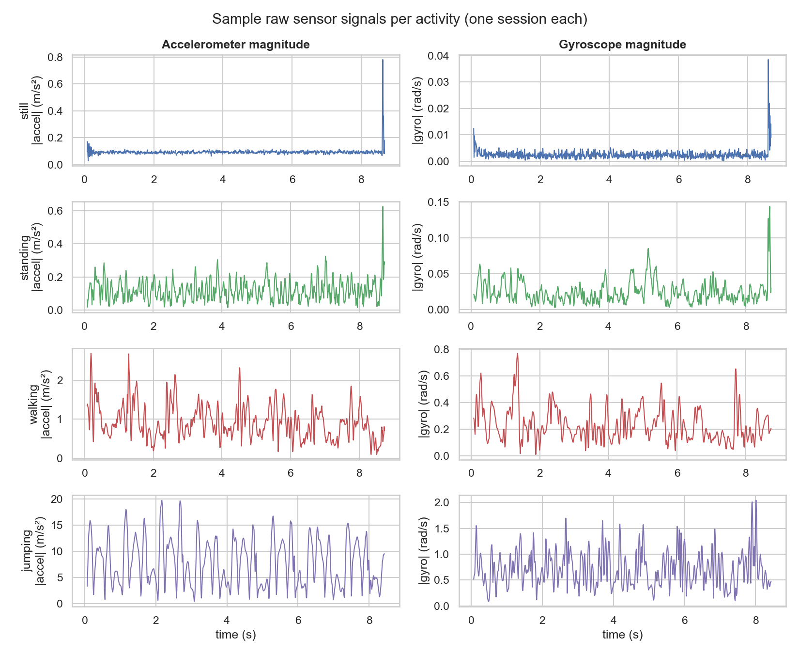
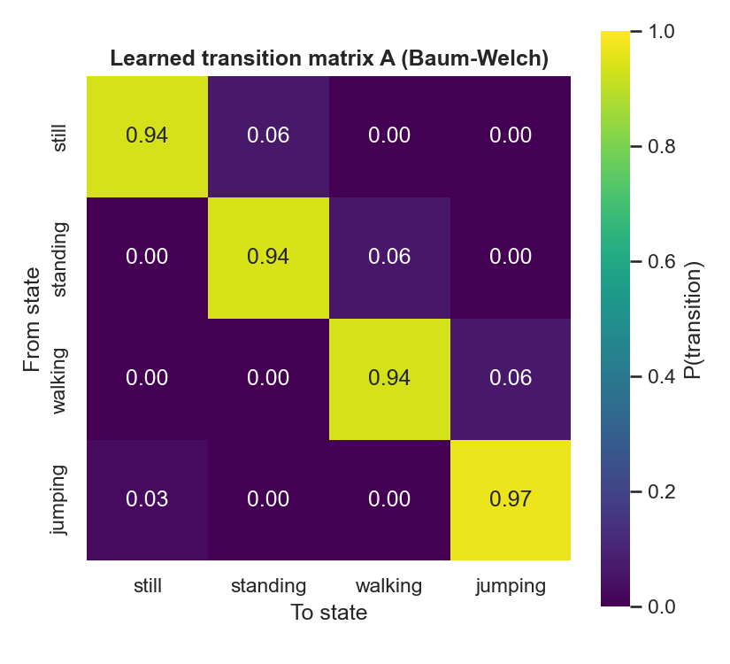
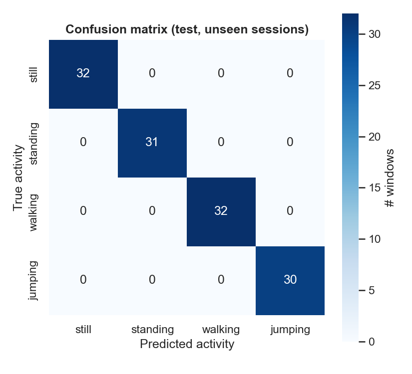
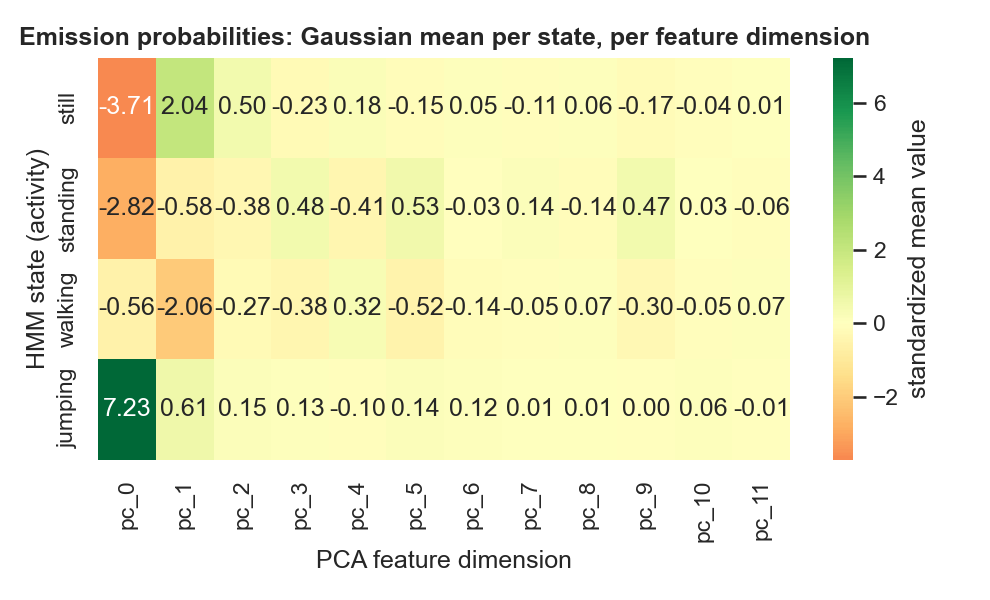

# Human Activity Recognition with a Hidden Markov Model

**Formative 2 — Hidden Markov Models**

A Gaussian-emission Hidden Markov Model, implemented entirely from scratch in NumPy/SciPy, that
infers four activity states — **still, standing, walking, jumping** — from smartphone
accelerometer and gyroscope signals. Training uses Baum-Welch (EM); decoding uses Viterbi.

## Why this problem

Wearable and smartphone sensors continuously stream noisy accelerometer/gyroscope signals, but
the activity that produced them is hidden and must be inferred from the measurements — the same
problem behind fall-detection alerts, fitness-tracker workout segmentation, and smart-home
occupancy sensing. An HMM fits naturally because activity is sequential and persistent: someone
walking now is far more likely to still be walking a second later than to have jumped state, which
is exactly the temporal structure a transition matrix is built to capture.

## Data collection

| | |
|---|---|
| Device | iPhone 13 Pro Max, Sensor Logger app |
| Sampling rate | 100 Hz (`sampleRateMs=10`, confirmed identical across all 52 sessions) |
| Activities | Still, Standing, Walking, Jumping |
| Sessions | 13 per activity, 52 total, each 5-10s |
| Total duration | 111-113s per activity (exceeds the 90s minimum) |



## Method

1. **Windowing** — 1.0s windows (100 samples), 50% overlap, derived directly from the 100 Hz
   sampling rate. 822 windows total, balanced across all four classes.
2. **Feature extraction** — 32 features per window: per-axis mean/std, Signal Magnitude Area, and
   inter-axis correlation (time-domain), plus dominant FFT frequency, spectral energy, and spectral
   entropy on the accelerometer/gyroscope magnitude (frequency-domain).
3. **Normalization** — Z-score standardization (fit on training windows only), then PCA to 12
   components retaining 95% of training variance, for numerically stable covariance estimation.
4. **Model** — a 4-state `GaussianHMM` (`src/hmm.py`), trained with Baum-Welch in log-space
   (K-means++ initialization, 10 random restarts, genuine `|ΔlogL| < tol` convergence check — not
   a fixed iteration count), decoded with Viterbi. Validated against synthetic data with known
   ground truth before touching real data (`tests/test_hmm_synthetic.py`).
5. **Evaluation** — session-level train/test split (8 sessions held out, never seen during
   training), decoded on entirely unseen recordings.

## Results

| Activity | Samples | Sensitivity | Specificity | Accuracy |
|---|---|---|---|---|
| Still | 32 | 1.000 | 1.000 | 1.000 |
| Standing | 31 | 1.000 | 1.000 | 1.000 |
| Walking | 32 | 1.000 | 1.000 | 1.000 |
| Jumping | 30 | 1.000 | 1.000 | 1.000 |

<table>
<tr>
<td></td>
<td></td>
</tr>
</table>

This result is verified, not just reported: a session-level leakage check (test sessions share
zero IDs with training, transformers fit on training data only), cross-validation across 5
independently-drawn train/test splits, an emission-only ablation (removing the transition prior
entirely still scores 99.2%, showing the sequence structure isn't inflating the number), and a
label-shuffle test (scrambling activity labels collapses accuracy to 38%, near the 25% chance
floor) — all four checks live as runnable cells in the notebook, not just claims.



A perfect score should be read in context: the four activities were recorded as deliberately
distinct, controlled motions with large gaps in movement intensity (jumping's signal variance is
~80x still's), which makes this a comparatively easy separation task for this dataset — not
evidence the model would generalize equally well to ambiguous, continuously-monitored real-world
movement. Full discussion in the report and notebook.

## Repository layout

```
data/                 52 labelled recording sessions, one folder per activity
src/                  the pipeline, as importable modules
  data_utils.py          load sessions, window them, extract features
  hmm.py                  GaussianHMM: Baum-Welch training, Viterbi decoding
  sequences.py            train/test session split, composite sequence construction
  evaluate.py             sensitivity/specificity/accuracy/confusion matrix
  visualize.py            all figure-generating functions
  run_pipeline.py         end-to-end script: data -> features -> model -> metrics
  make_figures.py         generates every figure into outputs/figures/
tests/
  test_hmm_synthetic.py  validates the HMM against synthetic data with known ground truth
notebooks/
  HMM_Activity_Recognition.ipynb   the full, executed walkthrough
outputs/
  models/                trained model + scaler/PCA, saved
  results/               metrics and tables as CSV
  figures/               every plot, as PNG
reports/
  report.md              short summary (the full formal report is submitted separately)
```

## Running it

```
pip install -r requirements.txt
python3 tests/test_hmm_synthetic.py     # sanity-checks the HMM math on synthetic data
python3 src/run_pipeline.py             # runs the full pipeline, prints metrics
python3 src/make_figures.py             # regenerates every figure in outputs/figures/
jupyter nbconvert --to notebook --execute --inplace notebooks/HMM_Activity_Recognition.ipynb
```

## Notes on the approach

Raw recordings are isolated single-activity clips — no session contains a real activity switch —
so composite training sequences are built by chaining sessions from different activities in
rotation, giving Baum-Welch real transitions to learn from while every window keeps its
ground-truth label. This construction, and its implications for how literally to read the learned
transition matrix, is discussed in the report and in the notebook.
