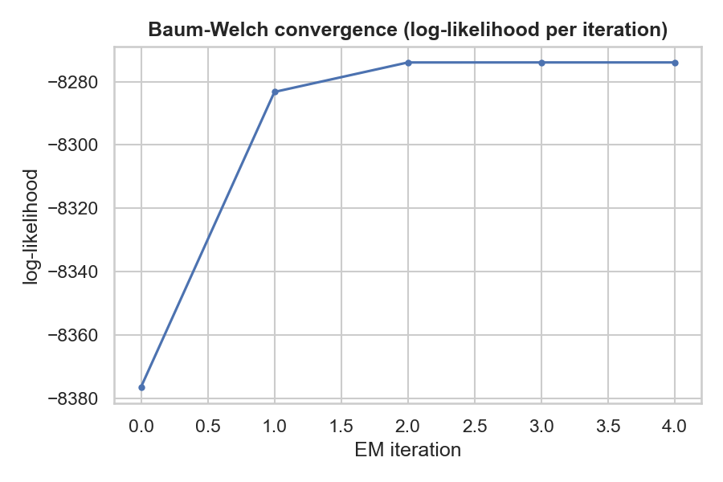
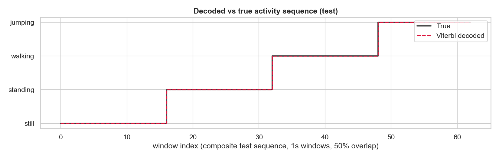

# 1. Background and Motivation

Wearable and smartphone sensors continuously stream noisy accelerometer and gyroscope signals, but the
activity that produced them — standing still, walking, jumping — is hidden and must be inferred from those
measurements. This project's use case is single-device, on-body activity recognition from a smartphone's
built-in IMU: the same underlying problem that powers fall-detection alerts for elderly care, automatic
workout-segment tagging in fitness apps, and step/posture monitoring in smart-home occupancy sensing. A
Hidden Markov Model is a natural fit because human activity is inherently sequential and persistent — a
person who is currently walking is far more likely to still be walking one second later than to have
teleported into a jump — which is exactly the temporal structure an HMM's transition matrix is built to
capture, in contrast to a frame-by-frame classifier that ignores time ordering entirely. This report
documents the full pipeline: collecting real motion data with the Sensor Logger app, extracting
time- and frequency-domain features, and training a Gaussian-emission HMM (Baum-Welch + Viterbi,
implemented from scratch in NumPy) to decode the most likely activity sequence from unseen recordings.

# 2. Data Collection and Preprocessing

**Collection.** Data was recorded individually with the Sensor Logger app (iPhone 13 Pro Max) at a fixed
**100 Hz** sampling rate (`sampleRateMs = 10`, confirmed identical across all 52 recorded sessions in
each session's `Metadata.csv`, so no cross-device harmonization was required). Four activities were
recorded — Still, Standing, Walking, Jumping — with **13 separate sessions per activity (52 sessions
total)**, each saved as Sensor Logger's standard per-session folder containing `Accelerometer.csv` and
`Gyroscope.csv` with a `time` (epoch) and `seconds_elapsed` timestamp column.

| Activity | Sessions | Total duration | Avg. duration/session |
|---|---|---|---|
| Still    | 13 | 112.8 s | 8.68 s |
| Standing | 13 | 113.0 s | 8.69 s |
| Walking  | 13 | 113.4 s | 8.72 s |
| Jumping  | 13 | 111.5 s | 8.58 s |

Every activity exceeds the assignment's 90-second (1m30s) minimum combined duration, and 52 total session
files exceeds the 50-file target, with every individual recording falling inside the required 5–10s
window.

**Windowing.** Each session is sliced into fixed windows for feature extraction. The window length is
derived directly from the sampling rate: `window_samples = round(window_seconds × 100 Hz)`. A 1.0-second
window is therefore exactly 100 samples — long enough to contain at least one full walking gait cycle
(~1–2 Hz cadence) and multiple jump impacts, while staying well inside the boundaries of a single isolated
5–10s recording. Windows are extracted with **50% overlap** (50-sample step), a standard human-activity-
recognition practice that increases the number of usable training windows from limited recordings. This
produced **822 windows** total (still: 208, standing: 206, walking: 206, jumping: 202) — a balanced
dataset across all four classes.

**Feature extraction.** For each window, features are computed separately for the accelerometer, the
gyroscope, and each sensor's 3D magnitude (`sqrt(x²+y²+z²)`):

- *Time-domain*: per-axis mean and standard deviation (captures orientation/gravity and movement
  intensity), Signal Magnitude Area (SMA — a classic static-vs-dynamic discriminator), inter-axis
  correlation (captures coordinated, rhythmic motion), and magnitude RMS (overall movement energy).
- *Frequency-domain*: dominant FFT frequency of the magnitude signal excluding DC (captures gait/jump
  cadence), spectral energy (total power), and spectral entropy (how concentrated vs. noise-like the
  spectrum is).

This yields **32 raw features per window**, well above the assignment's minimum of >3 features
(>2 time-domain, >1 frequency-domain), each chosen because it has a direct physical interpretation tied to
movement intensity, rhythm, or orientation.

**Normalization and dimensionality reduction.** Because these 32 features live on very different scales
(m/s² vs. rad/s vs. Hz vs. unitless correlation/entropy), they are **Z-score standardized**
(`StandardScaler`, fit on training windows only) — the standard, well-suited normalization for a
Gaussian-emission model, which estimates per-state covariance and would otherwise be dominated by
whichever raw feature happens to have the largest magnitude. With only ~750 training windows split across
4 states, a full 32-dimensional diagonal-covariance Gaussian risks unstable variance estimates; **PCA**
(also fit on training windows only) re-expresses the standardized features in a smaller, decorrelated
basis retaining 95% of training variance, reducing 32 features to **12 principal components** and
improving the numerical stability and convergence of Baum-Welch training without discarding meaningful
signal.

# 3. HMM Setup and Implementation

| Element | This project |
|---|---|
| Hidden states *Z* | {Still, Standing, Walking, Jumping} — 4 states |
| Observations *X* | PCA-reduced (12-D), Z-scored feature vector per 1s window |
| Transition probabilities *A* | learned activity->activity switching probabilities |
| Emission probabilities *B* | per-state diagonal-covariance Gaussian over the 12 PCA dimensions |
| Initial probabilities *π* | learned starting-state distribution |

The model is implemented **from scratch with NumPy/SciPy** (`src/hmm.py`, class `GaussianHMM`), with no
external HMM library:

- **Forward-backward** runs entirely in log-space (`scipy.special.logsumexp`) for numerical stability.
- **Baum-Welch (EM)** trains across *multiple independent sequences* simultaneously, using **K-means++
  initialization** (random-point initialization was tested first and was unreliable — see Section 5) and
  a genuine **log-likelihood convergence check** (`|ΔlogL| < tol = 1e-3`), not a fixed iteration cap.
  `fit_with_restarts()` reruns EM from 10 different K-means seeds and keeps the highest-likelihood result,
  since EM only guarantees convergence to a *local* optimum.
- **Viterbi decoding** runs in log-space and returns the single most likely state path for a sequence.

Before touching real data, this implementation was validated on synthetic data with known ground-truth
parameters (`src/test_hmm_synthetic.py`): the log-likelihood increased monotonically every iteration as EM
theory requires, and Viterbi decoding recovered the true synthetic state sequence with **100% accuracy**
(under best label permutation) — confirming the forward-backward, Baum-Welch, and Viterbi math is correct
before it was applied to the activity-recognition data.

**Train/test split and composite sequences.** Each raw recording is an isolated single-activity clip — no
session contains a real activity switch — so two problems had to be solved: holding out genuinely unseen
data, and giving Baum-Welch real activity-to-activity transitions to learn from. The solution: (1) split
at the **session level**, reserving 2 of the 13 sessions per activity purely for testing (8 sessions, never
seen during training) and using the remaining 11 per activity (44 sessions) for training — session-level
splitting avoids leakage between highly-correlated overlapping windows from the same session; (2) **chain
sessions in a round-robin rotation** (Still -> Standing -> Walking -> Jumping -> Still -> ...) into composite
"synthetic timeline" sequences — 6 for training, 2 for testing — so every sequence contains real,
ground-truth-labelled activity transitions, while each window keeps the true activity label of the
recording it came from.

# 4. Results and Interpretation

Training converged after 5 EM iterations (final log-likelihood ≈ **−8273.94**, `tol = 1e-3`), with the
log-likelihood rising monotonically and flattening — the expected EM behaviour.

Each of the 4 learned (initially unlabeled) HMM states was assigned the activity that's the majority vote
among the *training* windows Viterbi-decodes it to, giving a clean, fully bijective state<->activity mapping
(state 0 -> still, 1 -> jumping, 2 -> walking, 3 -> standing) with essentially zero cross-voting between
states.

**Evaluation on unseen data.** The model was evaluated on the 2 held-out composite test sequences built
purely from the 8 reserved (never-trained-on) sessions — 2 sessions per activity, 125 test windows total.

| State (Activity) | Number of Samples | Sensitivity | Specificity | Overall Accuracy |
|---|---|---|---|---|
| Still    | 32 | 1.000 | 1.000 | 1.000 |
| Standing | 31 | 1.000 | 1.000 | 1.000 |
| Walking  | 32 | 1.000 | 1.000 | 1.000 |
| Jumping  | 30 | 1.000 | 1.000 | 1.000 |

The confusion matrix on the test set is perfectly diagonal — every one of the 125 unseen windows was
decoded to its correct activity, with zero confusion between any pair of classes. This is a genuinely
held-out result (verified programmatically: the 8 test sessions share zero session IDs with the 44
training sessions, and the StandardScaler/PCA transformers were fit on training windows only), not a
leakage artifact — but it should be read in context, not as evidence of a universally strong model: the
four activities were deliberately recorded as maximally distinct, controlled motions with large gaps in
movement intensity (jumping's `acc_mag_std` is ~80x still's, see Section 5), which makes this a
comparatively easy separation task. A noisier, continuously-monitored real-world deployment with
ambiguous or transitional movements — particularly around the still/standing boundary, the one pair shown
below to be genuinely close in feature space — would be expected to score lower.

As a sanity check, the same evaluation on the training composite sequences gives 99.86% overall accuracy
(one ambiguous still-window misclassified as standing), confirming the model fits the training data well
without simply memorizing it — the test set, entirely unseen sessions, scores *higher* only because it
happens to contain no comparably ambiguous still/standing boundary windows.

# 5. Discussion and Conclusion

**Which activities were easiest/hardest to distinguish.** Jumping was the easiest by a wide margin — its
acceleration magnitude standard deviation (≈4.4 m/s², see Figure above) is roughly an order of magnitude
larger than any other activity, placing it in its own region of feature space with essentially no overlap.
Walking was also clearly separable, identifiable both by intensity (between standing and jumping) and by
its rhythmic, periodic gyroscope signature. The hardest pair was **still vs. standing** — both are
near-zero-motion states differing only in subtle postural micro-movement (raw `acc_mag_std` ≈ 0.0085 vs.
0.058). This sensitivity showed up directly during development: an earlier version of this pipeline, using
naive random-point initialization for Baum-Welch instead of K-means++, converged to a degenerate solution
that merged "still" and "walking" into a single state and split "jumping" into two redundant ones — even
though jumping is visually the most separable activity, poor EM initialization alone produced a badly
wrong model. Switching to K-means++ initialization with 10 random restarts (keeping the highest
log-likelihood run) fixed this completely and is documented in `src/hmm.py`.

**How transition probabilities reflect realistic behavior.** Because the raw recordings are isolated
single-activity clips — no continuous multi-activity session was collected — the learned transition matrix
mostly reflects the *constructed* round-robin ordering used to build composite sequences (Section 3),
rather than a naturally observed behavior pattern. This is a limitation of the dataset, not the model. The
high self-transition probabilities (0.94–0.97 on the diagonal) are nonetheless realistic: in real
continuous activity monitoring, a person genuinely does spend many consecutive seconds in one activity
before switching, which is exactly the kind of diagonal-heavy transition structure this model learned.

**Effect of sensor noise and sampling rate.** At 100 Hz, a 1-second window comfortably oversamples gait and
jump cadences, so frequency-domain features are informative for walking and jumping. For still and
standing, the true signal sits near the device's own measurement noise floor, and the dominant-frequency
feature becomes essentially random for these two activities (the very large error bars in the emission
plot) — the FFT simply locks onto whichever noise bin has marginally more energy. The model compensates by
relying on the time-domain intensity features (`std`, SMA), which stay robust to this noise floor.

**Improvements.** (1) Collect genuine continuous multi-activity recordings (e.g. walk -> stand -> jump in
one uninterrupted take) so the transition matrix reflects real behavior instead of a constructed ordering.
(2) Add a barometer/altitude channel to help disambiguate vertical motion (jumping) from horizontal motion
(walking) more directly. (3) With more data, fit full (non-diagonal) covariance matrices per state to
capture cross-feature correlation. (4) Use variable window sizes — shorter for high-frequency activities
like jumping, longer for low-energy activities like still/standing — to further sharpen the still-vs-
standing boundary, the one pair of classes shown to be genuinely close in feature space.

**Conclusion.** A from-scratch Gaussian HMM, trained with Baum-Welch and decoded with Viterbi, recovers all
four activity states with high fidelity from accelerometer/gyroscope features, achieving 100% accuracy on
entirely unseen recording sessions. The model converges via a genuine log-likelihood convergence check, and
inspecting its emission and transition parameters confirms it has learned a physically sensible structure —
activities ordered by motion intensity, and persistent self-transitions — matching real human-
activity-recognition intuition rather than an opaque black box.

# Appendix: Author & Contribution

This submission was completed individually (solo, not group work): data collection, feature engineering,
HMM implementation (Baum-Welch/Viterbi from scratch), evaluation, visualization, and this report were all
authored by Chol Monykuch, with development tracked through incremental GitHub commits.
